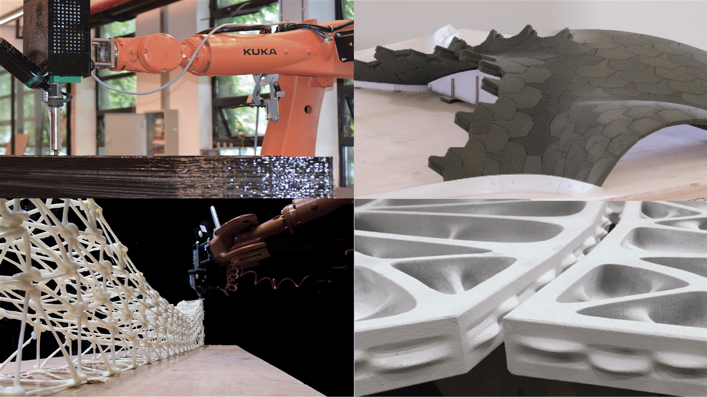

# [ETH-MIT-Tongji IAP2019](http://www.block.arch.ethz.ch/brg/teaching/robotic-force-printing)



## Public Lectures by Prof. Philippe Block

* **[Public Lecture](https://www.dropbox.com/s/6sq1ypvg06iaabq/20190110_Tongji_PBlock.pdf?dl=0) by Prof. Philippe Block** in Tongji University
* **[Public Lecture](https://www.dropbox.com/s/q9a3cj5mkaanqaa/20190112_Chengdu_PBlock.pdf?dl=0) by Prof. Philippe Block** in Chengdu


## Installation

1. Download Source Code Editor: [Visual Studio Code](files/softwares)
2. Download [GitHub Desktop Client](https://desktop.github.com/)
3. Download [Anaconda](https://conda.io/docs/user-guide/install/download.html) and install it. (During installation, check add conda to system path.)
4. Add conda forge ```conda config --add channels conda-forge``` before installing. 
5. [Install Compas](https://compas-dev.github.io/main/gettingstarted.html) ```conda install COMPAS```. 
6. [Install Compas to Rhino](https://compas-dev.github.io/main/environments/rhino.html) ```python -m compas_rhino.install 5.0``` (run as administrator.)
7. Install Additional Compas packages, and update Ironpython 2.7.5 and system paths.
	- [compas_tna](https://github.com/BlockResearchGroup/compas_tna)
	- [compas_pattern](https://github.com/BlockResearchGroup/compas_pattern)
	- [compas_ghc](https://github.com/BlockResearchGroup/compas_ghc)
	
8. Install Grasshopper [Plugins](files/gh_plugins). 
	- [PhysX.GH](https://www.food4rhino.com/app/physxgh) [source](https://github.com/TheAsianCoders/PhysX.GH) 
	- [Leopard](https://www.food4rhino.com/app/leopard) [source](https://github.com/GeneKao/Leopard)


## Teaching Schedule

### 2014.01.09.Wednesday [Day 1]

9:00-12:00 

* **Lecture**
	- Workshop Introduction by **Prof. Philip F. YUAN**
	- [Modules and Course Introduction](https://docs.google.com/presentation/d/1ch_CNHoBCgODurvXJfui0z5O44kCb2cGiayMbf04RkQ/edit?usp=sharing)
	- [COMPAS Introduction](https://docs.google.com/presentation/d/1szGW5Y8Omr38xClVXZvB6Lpv5BKp4DTBdZLb9RZ1Suo/edit?usp=sharing)


13:30-17:00 

* **Tutorial** 
	- Installation and Setup Trouble-shooting

* **Module 1** 
	- [Python Configuration and Programming Foundation 101](src/day_1)
		- Python 101: basic to define function
		- Python 102: oop; making point and line object
		- Compas 101: draw point and line using compas 
		- Compas 102: smoothing with plotter
		- Compas 102 Rhino: smoothing in Rhino

18:30-20:00 

* **Public Lecture by Prof. Mike XIE**

### 2014.01.10.Thursday [Day 2]

9:00-12:00 

* **[Day 2 Introduction](https://docs.google.com/presentation/d/1JSbZEt0opbu0KsZE-8JaI71-VDB3MsrS50kQ4Ox4ViY/edit?usp=sharing)**

* **Exercise**
   	- Coding Exercise: create your own polyline class

* **Module 2** 
	- [Fundamental Computational Structural Design Concepts](https://docs.google.com/presentation/d/1p-zv9mRVL2ffMIHJFr2sJzslBhXStucicSSJTQTOSq0/edit?usp=sharing)

13:30-17:00 

* **Module 3** 
	- [Geometry and Topology I: Structural Pattern](https://docs.google.com/presentation/d/1Mpj6PGHHrZVQNyfFuvl7Y0jwOUePlhPP2sftHdBiX4w/edit?usp=sharing
)
	
18:30-20:00 

* **[Public Lecture](files/slides/20190110_Tongji_PBlock.pdf) by Prof. Philippe Block**


### 2014.01.14.Tuesday [Day 3]

* **[Day 3 Introduction](https://docs.google.com/presentation/d/1QNpw53mhzGUWgBwdXUhrocquuJDV5Qe2vQMg33XIf8w/edit?usp=sharing)** 
	
10:00-12:00 

* **Module 5** 
	- [Geometry and Topology II: Form-Finding](https://docs.google.com/presentation/d/1ht2UYKxPIyyHLVDRV91_yOpAvkhNgQBPZAGNdW2FSWo/edit?usp=sharing)

13:30-17:00 

* **[Module 4 & 6](https://docs.google.com/presentation/d/1MCfmjLLHdOTIWeK9YPZzjk2PheW_E_peroC9QQ-NHjc/edit?usp=sharing)** 
	- [Panelization & Tessellation](src/day_3/m4_tessellation)
		- remesh
		- dual mesh
		- interface generation
		- planarize interface
		- voussoir generation

	- [Equilibrium-Informed Assembly](src/day_3/m6_assembly)
		- physics simulation using physx
		- sequencing

* **Module 7** 
	- [Design Space Exploration and Optimization](https://docs.google.com/presentation/d/1JsCds5WZX60LkjQjGuFmW6MxCGFZ3vXNO2U-KQ83zC4/edit?usp=sharing)
	

### 2014.01.15.Wednesday [Day 4]

10:00-12:00

* **Module 5.5** from Tongji
	- [Geometry and Topology II: Form-Finding](src/day_4)

